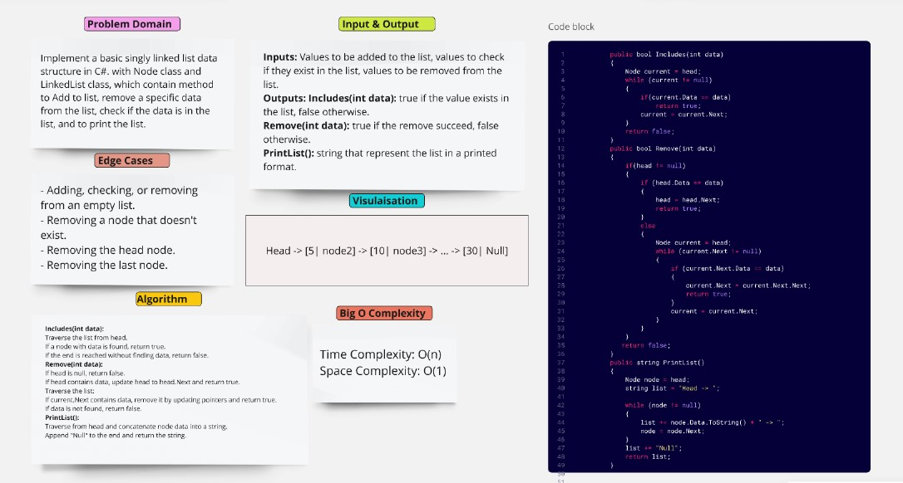
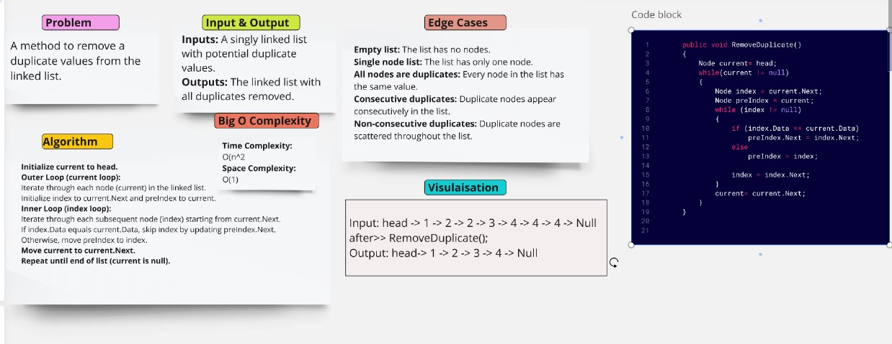
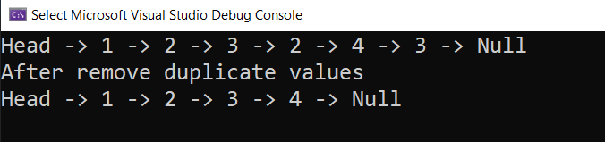

### Challenge Name: LinkedList Implementation 
Implement a basic singly linked list data structure in C#. with Node class and LinkedList class, which contain method to Add to list, remove a specific data from the list, check if the data is in the list, and to print the list. 

### Challenge Name: Remove Duplicate from the linkedlist 
A method to remove a duplicate values from the linked list. 

