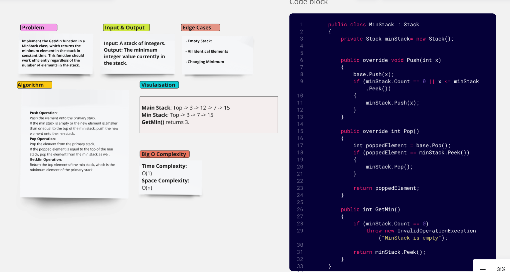
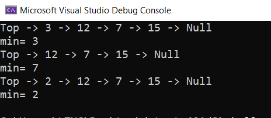

# Min Stack

Implementation of the GetMin function in a MinStack class, which returns the minimum element in the stack in constant time. This function should work efficiently regardless of the number of elements in the stack.

