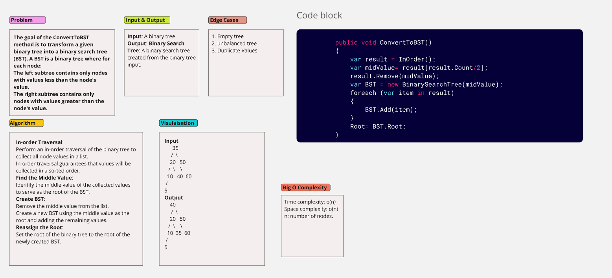

# Convert Binary tree to Binary Search Tree

The goal of the ConvertToBST method is to transform a given binary tree into a binary search tree (BST). A BST is a binary tree where for each node:
The left subtree contains only nodes with values less than the node's value.
The right subtree contains only nodes with values greater than the node's value.

