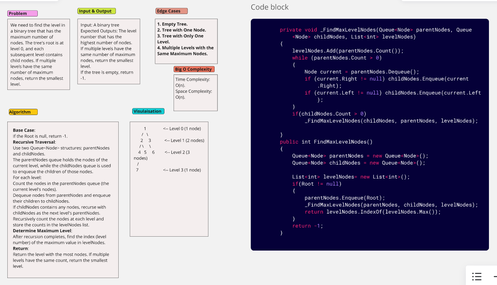
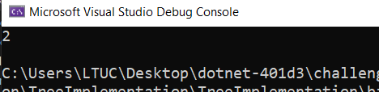

# Max Level Nodes:

We need to find the level in a binary tree that has the maximum number of nodes. The tree's root is at level 0, and each subsequent level contains child nodes. If multiple levels have the same number of maximum nodes, return the smallest level.

