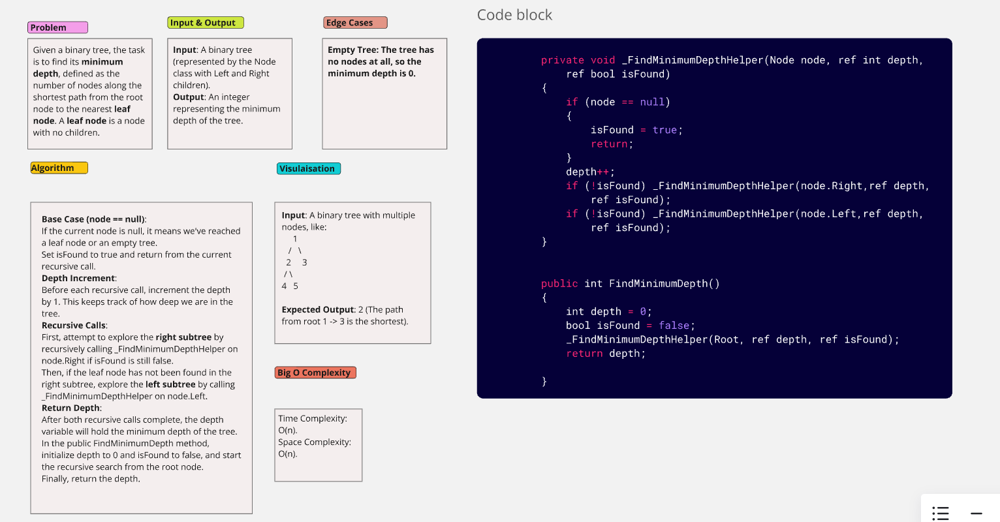
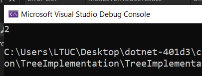

# Minimum Depth of Binary Tree

Given a binary tree, find its minimum depth, defined as the number of nodes along the shortest path from the root node to the nearest leaf node. A leaf node is a node with no children.

