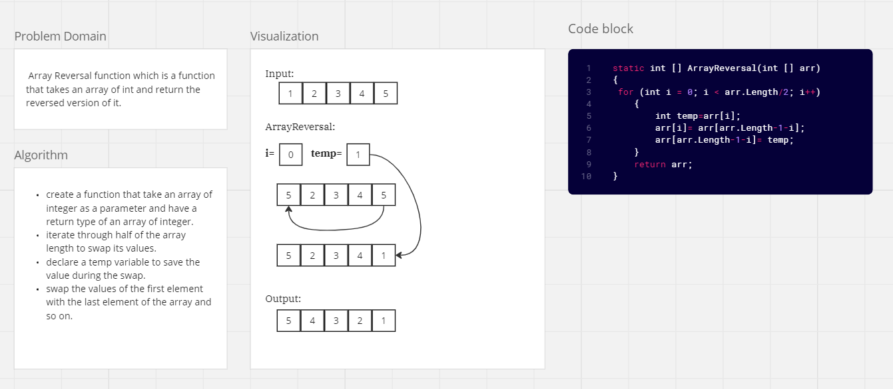
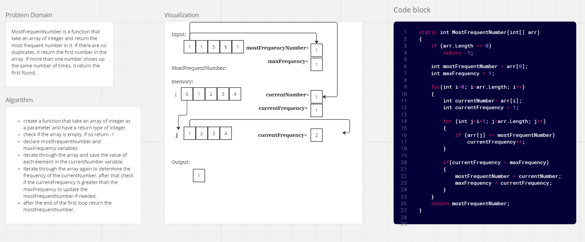
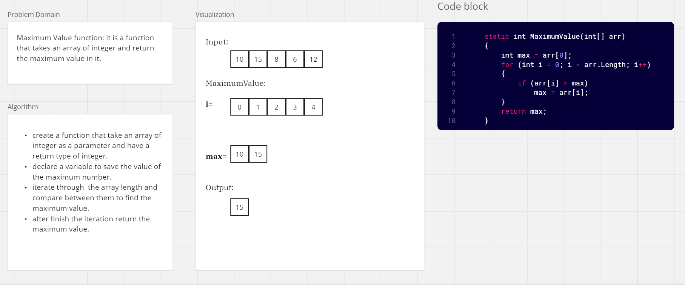
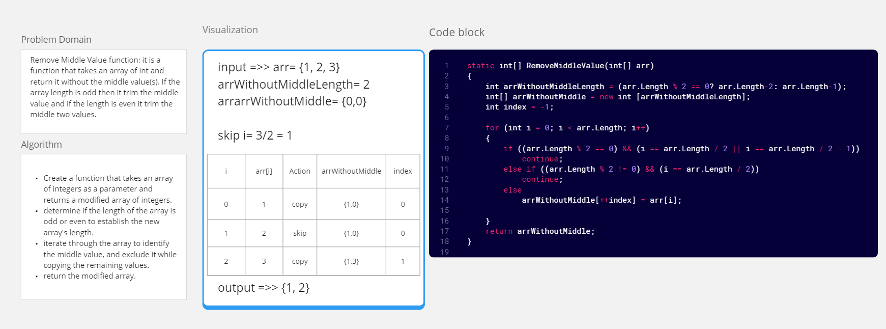
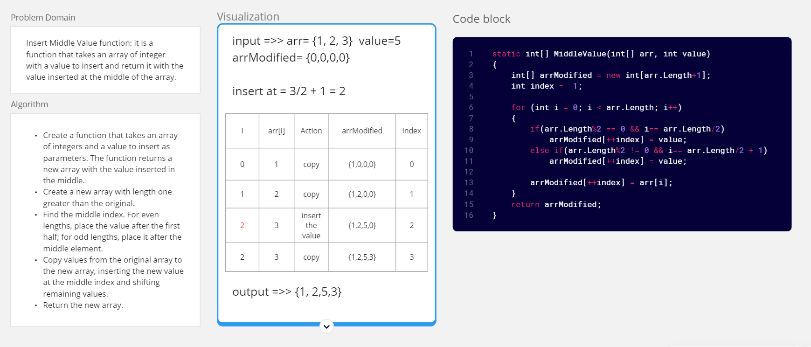
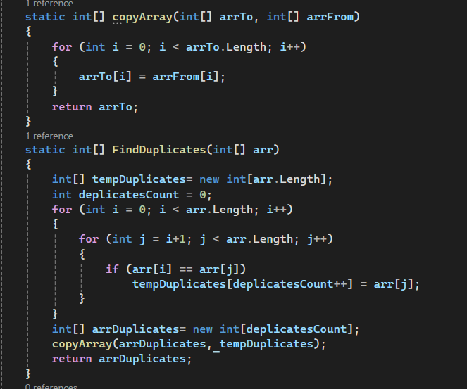

### Whiteboard Images

### Challenge 01: Array Reversal
A function that takes an array of int and return the reversed  version of it.  

### Challenge 02: Most Frequent Number
A function that take an array of int and return the most frequent number in it. If there are no duplicates, it return the first number in the array. If more than one number shows up the same number of times, it return the first found.

### Challenge 03: Maximum Value
A function that takes an array of int and return the maximum value in it. 

### Challenge 04: Remove Middle Value
A function that takes an array of int and return it without the middle value(s). If the array length is odd then it trim the middle value and if the length is even it trim the middle two values. 

### Challenge 05: Insert Middle Value
A function that takes an array of int with a value to insert and return it with the value inserted at the middle of the array.  

### Challenge 06: Find Duplicates
A function that takes an array of int and find the duplicates values in it then return them in an array of int. 

### Challenge 06: Find Common Elements
A function that takes two array of int and find the common elements between them then return those elements in array of int.

### Challenge 07: Reverse Words
[Reverse Words](./Challenges/Reverse-Words/Readme.md)

### Challenge 08: LinkedList Implementation 
[LinkedList Implementation](./Challenges/Data-Structures/LinkedList/README.md)

### Challenge 09: Remove Duplicate from the linkedlist 
[Remove Duplicate](./Challenges/Data-Structures/LinkedList/README.md)
